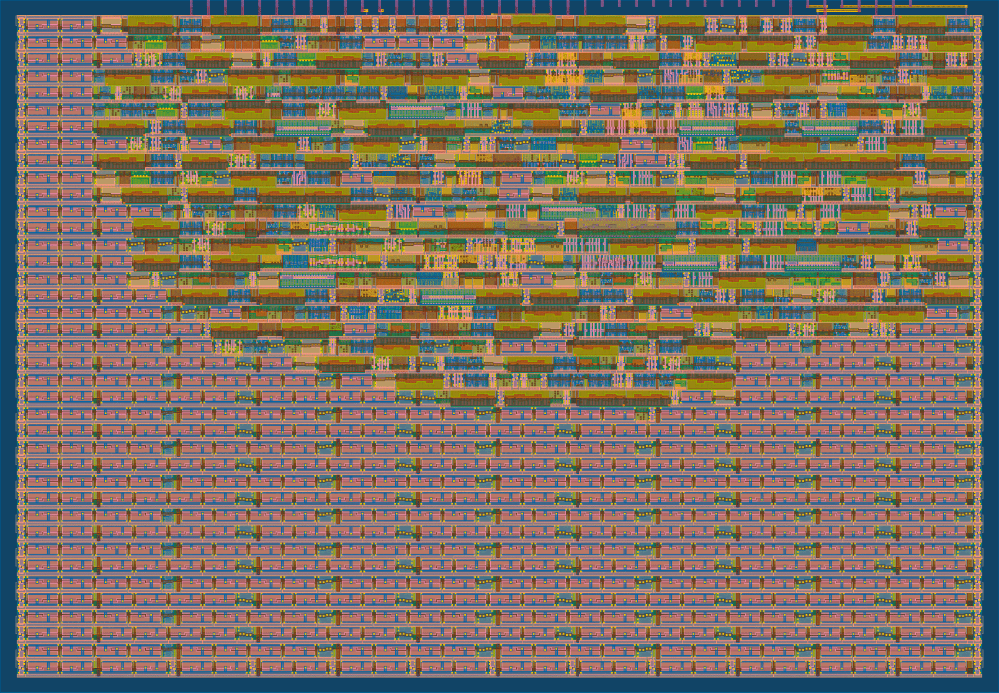

   

# SPI-Configurable Watchdog Timer

A windowed watchdog timer for an external MCU, configured over SPI, built for
[Tiny Tapeout](https://tinytapeout.com) sky26c.

- Eight timeouts from 5.24 ms to 5.37 s (at 50 MHz), stretchable up to 128x
  by a prescaler.
- Window mode: a kick that comes too early is a fault, catching firmware
  stuck in a tight kick loop.
- Two-stage response: an `IRQ` warning with a grace period first, then an
  active-low reset pulse. During the grace period the MCU gets one last
  chance to cancel the reset.
- Fault flags survive the reset pulse, so the MCU can read back why it was
  reset.

📖 **[Full documentation (datasheet source)](docs/info.md)** — interface,
SPI register map, state machine, and timing.

## GDS

[View in 3D](https://gds-viewer.tinytapeout.com/?pdk=sky130A&model=https%3A%2F%2Fjingjeryen.github.io%2Ftt-spi-watchdog%2Ftinytapeout.oas)

## Testing

The cocotb testbench lives in [test/](test/); see
[test/README.md](test/README.md) for how to run it at RTL and gate level.

## What is Tiny Tapeout?

Tiny Tapeout is an educational project that makes it easier and cheaper than
ever to get your digital and analog designs manufactured on a real chip.
To learn more and get started, visit https://tinytapeout.com.
