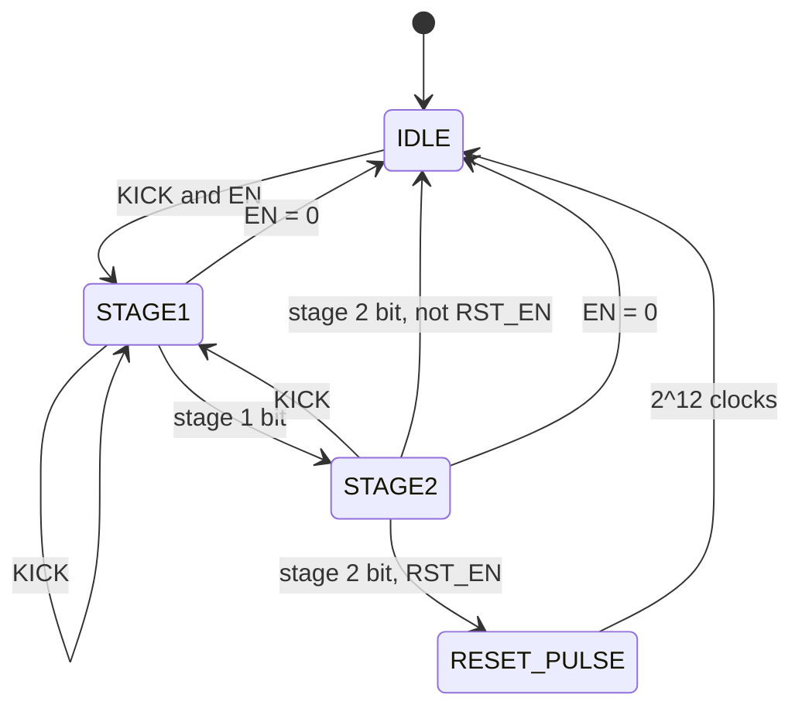

<!---

This file is used to generate your project datasheet. Please fill in the information below and delete any unused
sections.

You can also include images in this folder and reference them in the markdown. Each image must be less than
512 kb in size, and the combined size of all images must be less than 1 MB.
-->

## How it works

A watchdog timer for an external MCU, configured over SPI.

The MCU sets a timeout and then feeds the watchdog periodically, either by an
SPI write or by a rising edge on a dedicated pin. If feeding stops, the
watchdog asserts `IRQ` at the timeout and `RST_N` at twice the timeout.

The timeout is one of sixteen settings from 655 us to 21 s at 50 MHz. Each
stage can be enabled independently.


## How to test

### Interface

| Signal       | Dir | Description                                                  |
| ------------ | --- | ------------------------------------------------------------ |
| `ui_in[0]`   | In  | `SCLK` — SPI clock from the master                            |
| `ui_in[1]`   | In  | `MOSI` — SPI data in (master -> this chip)                    |
| `ui_in[2]`   | In  | `CS_N` — SPI chip select, active low                          |
| `ui_in[3]`   | In  | `PAUSE` — freeze the watchdog counter while high              |
| `ui_in[4]`   | In  | `KICK` — feed the dog on a rising edge                         |
| `ui_in[7:5]` | In  | Unused                                                        |
| `uo_out[0]`  | Out | `MISO` — SPI data out (this chip -> master)                   |
| `uo_out[1]`  | Out | `IRQ` — watchdog timeout interrupt, active high               |
| `uo_out[2]`  | Out | `RST_N` — watchdog reset output, active low, idles high        |
| `uo_out[7:3]`| Out | Unused, driven low                                            |
| `uio[7:0]`   | —   | Unused                                                        |
| `clk`        | In  | System clock. Timings below assume 50 MHz                     |
| `rst_n`      | In  | Active low reset, see below                                   |

`rst_n` clears the counter, the registers, `MISO` and `IRQ`. `RST_N` resets
to 1, its deasserted level.

### SPI frame

SPI mode 0 (CPOL=0, CPHA=0). MOSI is sampled on the rising edge of `SCLK`, MISO changes on the falling edge. A frame is 10 bits, MSB first, and is only valid while `CS_N` is low:

```
  bit   9    8  7    6  5  4  3  2  1  0
       [R/W][ ADDR ][       DATA       ]
```

- `R/W` - 1 = read, 0 = write
- `ADDR` - 2 bits register address
- `DATA` - 7 bits. On a write, the value to store. On a read, MOSI is ignored and the register value comes back on MISO in these 7 bit positions; MISO is 0 during the `R/W` and `ADDR` bits.

A frame takes effect only if exactly 10 bits were clocked in while `CS_N` was
low. Frames of any other length are discarded: no register is written and no
`KICK` is generated. The bit counter saturates rather than wrapping.

### SPI register map

| Addr | Name     | R/W   | Description                                          |
| ---- | -------- | ----- | ---------------------------------------------------- |
| 0    | `CTRL`   | RW    | Enables and timeout selection                        |
| 1    | `KICK`   | W     | Write `0x5A` to feed the dog. Other values ignored   |
| 2    | `STATUS` | R/W1C | Status flags, write 1 to clear                       |
| 3    | —        | —     | Unallocated                                          |

Reads of `KICK` and of address 3 return 0. Writes to address 3 are ignored.

#### `CTRL` (addr 0)

| Bit | Name       | Reset | Description                                         |
| --- | ---------- | ----- | --------------------------------------------------- |
| 0   | `EN`       | 0     | 1 = watchdog armed, 0 = disarmed and counter cleared |
| 1   | `IRQ_EN`   | 0     | 1 = `IRQ_FLAG` is allowed to drive the `IRQ` pin     |
| 2   | `RST_EN`   | 0     | 1 = `RST_N` may assert on stage 2 timeout            |
| 6:3 | `TIMEOUT`  | 0000  | Stage 1 timeout, see table                           |

`TIMEOUT` selects which counter bit marks stage 1, so the threshold is always a power of two.

| `TIMEOUT` | Clocks | Stage 1 @ 50 MHz | Stage 2 @ 50 MHz |
| --------- | ------ | ---------------- | ---------------- |
| 0000      | 2^15   | 655 us           | 1.3 ms           |
| 0001      | 2^16   | 1.3 ms           | 2.6 ms           |
| 0010      | 2^17   | 2.6 ms           | 5.2 ms           |
| 0011      | 2^18   | 5.2 ms           | 10.5 ms          |
| 0100      | 2^19   | 10.5 ms          | 21 ms            |
| 0101      | 2^20   | 21 ms            | 42 ms            |
| 0110      | 2^21   | 42 ms            | 84 ms            |
| 0111      | 2^22   | 84 ms            | 168 ms           |
| 1000      | 2^23   | 168 ms           | 336 ms           |
| 1001      | 2^24   | 336 ms           | 671 ms           |
| 1010      | 2^25   | 671 ms           | 1.3 s            |
| 1011      | 2^26   | 1.3 s            | 2.7 s            |
| 1100      | 2^27   | 2.7 s            | 5.4 s            |
| 1101      | 2^28   | 5.4 s            | 10.7 s           |
| 1110      | 2^29   | 10.7 s           | 21 s             |
| 1111      | 2^30   | 21 s             | 43 s             |

At the top setting stage 1 is counter bit 30 and stage 2 bit 31.

#### `STATUS` (addr 2)

| Bit | Name       | R/W | Description                                        |
| --- | ---------- | --- | -------------------------------------------------- |
| 0   | `IRQ_FLAG` | W1C | Stage 1 fired. Drives `IRQ` while `IRQ_EN` is 1    |
| 1   | `RST_FLAG` | W1C | Stage 2 fired. Does not drive any pin              |
| 2   | `ARMED`    | R   | 1 = counting. Set by the first `KICK`, cleared by  |
|     |            |     | `rst_n` or by clearing `EN`. Writes are ignored    |

Both flags are sticky: a `KICK` does not clear them, only `rst_n` or a W1C
write does.


### Watchdog behavior

A 32-bit up-counter with a four-state machine. Stage 1 is counter bit
`15 + TIMEOUT`, stage 2 the next bit up.



| State         | `ARMED` | Counter        | Sets on entry | `CTRL` writable |
| ------------- | ------- | -------------- | ------------- | --------------- |
| `IDLE`        | 0       | Held at 0      | —             | Yes             |
| `STAGE1`      | 1       | Increments     | —             | `EN` only       |
| `STAGE2`      | 1       | Increments     | `IRQ_FLAG`    | `EN` only       |
| `RESET_PULSE` | 0       | Counts to 2^12 | `RST_FLAG`    | `EN` only       |

`rst_n` returns to `IDLE` from any state and is the only way to abort
`RESET_PULSE`. Entering `IDLE` or `RESET_PULSE` clears the counter; a `KICK`
clears it without leaving the current state.

Reaching stage 2 always ends the cycle. `RST_EN` selects only whether a pulse
is emitted.

#### Kick

A `KICK` event is a rising edge on `KICK` (`ui_in[4]`), synchronised and edge
detected, or an SPI write of `0x5A` to the `KICK` register. Any other value
written to `KICK` is ignored.

| State                | Effect of `KICK`                        |
| -------------------- | --------------------------------------- |
| `IDLE`, `EN` = 1     | Enters `STAGE1`                         |
| `IDLE`, `EN` = 0     | Ignored                                 |
| `STAGE1`, `STAGE2`   | Counter clears, cycle restarts at stage 1 |
| `RESET_PULSE`        | Ignored, and not remembered             |

#### Configuration locking

`IDLE` is the only state in which `CTRL` can be changed. Elsewhere a write to
`CTRL` updates `EN` alone and the other bits are discarded. Reconfiguring
takes `EN` = 0, then the new `CTRL`, then a `KICK`.

#### Outputs

`IRQ` is `IRQ_FLAG AND IRQ_EN`, combinational. It deasserts only on a W1C
write to `IRQ_FLAG`, on `rst_n`, or when `IRQ_EN` is cleared. A `KICK` does
not deassert it.

`RST_N` is low for the whole of `RESET_PULSE` and high otherwise, a fixed
2^12 clocks, 82 us at 50 MHz. Neither `PAUSE`, `EN`, `TIMEOUT` nor the status
flags change that width.

#### `PAUSE`

`PAUSE` (`ui_in[3]`) freezes the counter while high in `STAGE1` and `STAGE2`,
without clearing it or changing state, and has no effect in the other two
states. `KICK` takes priority: a kick during `PAUSE` clears the counter,
which then stays frozen at 0. SPI access is unaffected.


## External hardware
