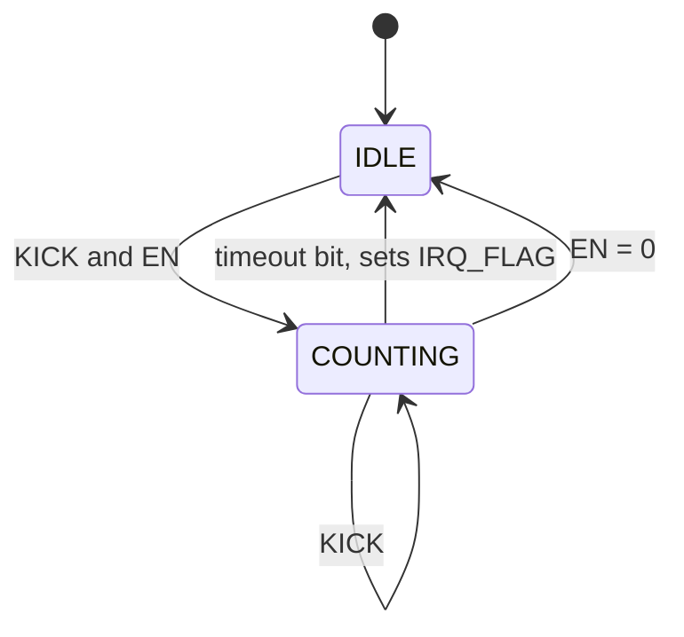

<!---

This file is used to generate your project datasheet. Please fill in the information below and delete any unused
sections.

You can also include images in this folder and reference them in the markdown. Each image must be less than
512 kb in size, and the combined size of all images must be less than 1 MB.
-->

## How it works

A watchdog timer for an external MCU, configured over SPI.

The MCU sets a timeout and then feeds the watchdog periodically, either by an
SPI write or by a rising edge on a dedicated pin. If feeding stops, the
watchdog asserts `IRQ` at the timeout, clears its counter and returns to idle.
`IRQ` stays asserted until it is cleared explicitly.

The timeout is one of eight settings from 5.24 ms to 5.37 s at 50 MHz.


## How to test

### Interface

| Signal       | Dir | Description                                                  |
| ------------ | --- | ------------------------------------------------------------ |
| `ui_in[0]`   | In  | `SCLK` — SPI clock from the master                            |
| `ui_in[1]`   | In  | `MOSI` — SPI data in (master -> this chip)                    |
| `ui_in[2]`   | In  | `CS_N` — SPI chip select, active low                          |
| `ui_in[3]`   | In  | `PAUSE` — freeze the watchdog counter while high              |
| `ui_in[4]`   | In  | `KICK` — feed the dog on a rising edge                         |
| `ui_in[7:5]` | In  | Unused                                                        |
| `uo_out[0]`  | Out | `MISO` — SPI data out (this chip -> master)                   |
| `uo_out[1]`  | Out | `IRQ` — watchdog timeout interrupt, active high               |
| `uo_out[7:2]`| Out | Unused, driven low                                            |
| `uio[7:0]`   | —   | Unused                                                        |
| `clk`        | In  | System clock. Timings below assume 50 MHz                     |
| `rst_n`      | In  | Active low synchronous reset, see below                                   |

`rst_n` clears the counter, the registers, `MISO` and `IRQ`.

### SPI frame

SPI mode 0 (CPOL=0, CPHA=0). MOSI is sampled on the rising edge of `SCLK`, MISO changes on the falling edge. A frame is 10 bits, MSB first, and is only valid while `CS_N` is low:

```
  bit   9    8  7    6  5  4  3  2  1  0
       [R/W][ ADDR ][       DATA       ]
```

`SCLK` is not used as a clock. It is sampled by the system clock and its
edges recovered, so `SCLK` must stay well below `clk`: each level has to be
held for at least two `clk` periods to be seen. That puts the ceiling near
`clk / 4`, so at 50 MHz keep `SCLK` at or below about 12 MHz, and prefer
5-10 MHz for margin. `CS_N` must likewise be stable for a few `clk` periods
before the first `SCLK` edge and after the last.

- `R/W` - 1 = read, 0 = write
- `ADDR` - 2 bits register address
- `DATA` - 7 bits. On a write, the value to store. On a read, MOSI is ignored and the register value comes back on MISO in these 7 bit positions; MISO is 0 during the `R/W` and `ADDR` bits.

A frame takes effect only if exactly 10 bits were clocked in while `CS_N` was
low. Frames of any other length are discarded: no register is written and no
`KICK` is generated. The bit counter saturates rather than wrapping.

### SPI register map

| Addr | Name     | R/W   | Description                                          |
| ---- | -------- | ----- | ---------------------------------------------------- |
| 0    | `CTRL`   | RW    | Enable, interrupt enable and timeout selection       |
| 1    | `KICK`   | W     | Write `0x5A` to feed the dog. Other values ignored   |
| 2    | `STATUS` | R/W1C | Status flags, write 1 to clear                       |
| 3    | —        | —     | Unallocated                                          |

Reads of `KICK` and of address 3 return 0. Writes to address 3 are ignored.

#### `CTRL` (addr 0)

| Bit | Name       | Reset | Description                                         |
| --- | ---------- | ----- | --------------------------------------------------- |
| 0   | `EN`       | 0     | 1 = watchdog armed, 0 = disarmed and counter cleared |
| 1   | `IRQ_EN`   | 0     | 1 = `IRQ_FLAG` is allowed to drive the `IRQ` pin     |
| 4:2 | `TIMEOUT`  | 000   | Timeout selection, see table                        |
| 6:5 | —          | 00    | Unimplemented, reads as 0                           |

`TIMEOUT` selects which counter bit marks the timeout, so the threshold is
always a power of two. The mapping is not a straight `18 + TIMEOUT`; see the
table.

| `TIMEOUT` | Clocks | Timeout @ 50 MHz |
| --------- | ------ | ---------------- |
| 000       | 2^18   | 5.24 ms          |
| 001       | 2^19   | 10.5 ms          |
| 010       | 2^20   | 21.0 ms          |
| 011       | 2^21   | 41.9 ms          |
| 100       | 2^22   | 83.9 ms          |
| 101       | 2^24   | 336 ms           |
| 110       | 2^26   | 1.34 s           |
| 111       | 2^28   | 5.37 s           |

The five lowest selections step by one exponent, keeping fine control where a
real-time control loop needs it. The top three step by two so the range still
reaches roughly five seconds without spending sixteen selections to get there.

#### `STATUS` (addr 2)

| Bit | Name       | R/W | Description                                        |
| --- | ---------- | --- | -------------------------------------------------- |
| 0   | `IRQ_FLAG` | W1C | Timeout fired. Drives `IRQ` while `IRQ_EN` is 1    |
| 1   | `ARMED`    | R   | 1 = counting. Set by the first `KICK`, cleared by  |
|     |            |     | `rst_n`, by clearing `EN`, or by a timeout.        |
|     |            |     | Writes are ignored                                 |

`IRQ_FLAG` is sticky: a `KICK` does not clear it, only `rst_n` or a W1C write
does.


### Watchdog behavior

A 29-bit up-counter with a two-state machine. The timeout fires on the counter
bit named by `TIMEOUT` in the table above, from bit 18 up to bit 28.



| State      | `ARMED` | Counter    | Sets on entry | `CTRL` writable |
| ---------- | ------- | ---------- | ------------- | --------------- |
| `IDLE`     | 0       | Held at 0  | —             | Yes             |
| `COUNTING` | 1       | Increments | —             | `EN` only       |

`rst_n` returns to `IDLE` from any state. Entering `IDLE` clears the counter;
a `KICK` clears it without leaving `COUNTING`.

On timeout the machine sets `IRQ_FLAG`, clears the counter and returns to
`IDLE`, so it stops counting until the next `KICK`. `IRQ_FLAG` is unaffected
by that transition and stays asserted.

#### Kick

A `KICK` event is a rising edge on `KICK` (`ui_in[4]`), synchronised and edge
detected, or an SPI write of `0x5A` to the `KICK` register. Any other value
written to `KICK` is ignored.

| State            | Effect of `KICK`                          |
| ---------------- | ----------------------------------------- |
| `IDLE`, `EN` = 1 | Enters `COUNTING`                         |
| `IDLE`, `EN` = 0 | Ignored                                   |
| `COUNTING`       | Counter clears, the timeout window restarts |

A `KICK` arriving in `IDLE` after a timeout starts a new cycle but does not
clear `IRQ_FLAG`.

#### Configuration locking

`IDLE` is the only state in which `CTRL` can be changed. In `COUNTING` a write
to `CTRL` updates `EN` alone and the other bits are discarded. Reconfiguring
takes `EN` = 0, then the new `CTRL`, then a `KICK`.

#### Outputs

`IRQ` is `IRQ_FLAG AND IRQ_EN`, combinational. It deasserts only on a W1C
write to `IRQ_FLAG`, on `rst_n`, or when `IRQ_EN` is cleared. A `KICK` does
not deassert it.

#### `PAUSE`

`PAUSE` (`ui_in[3]`) freezes the counter while high in `COUNTING`, without
clearing it or changing state, and has no effect in `IDLE`. `KICK` takes
priority: a kick during `PAUSE` clears the counter, which then stays frozen at
0. SPI access is unaffected.


## External hardware
