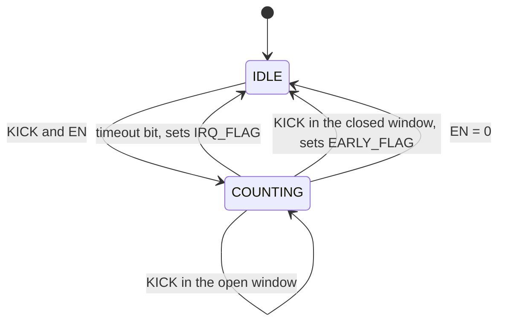

<!---

This file is used to generate your project datasheet. Please fill in the information below and delete any unused
sections.

You can also include images in this folder and reference them in the markdown. Each image must be less than
512 kb in size, and the combined size of all images must be less than 1 MB.
-->

## How it works

A watchdog timer for an external MCU, configured over SPI.

The MCU sets a timeout and then feeds the watchdog periodically, either by an
SPI write or by a rising edge on a dedicated pin. If feeding stops, the
watchdog asserts `IRQ` at the timeout, clears its counter and returns to idle.
`IRQ` stays asserted until it is cleared explicitly.

The timeout is one of eight settings from 5.24 ms to 5.37 s at 50 MHz, and a
prescaler stretches that range by up to 128x. A windowed mode can also reject
an early kick, which catches firmware stuck in a tight loop feeding the dog
faster than it should.


## How to test

### Interface

| Signal       | Dir | Description                                                  |
| ------------ | --- | ------------------------------------------------------------ |
| `ui_in[0]`   | In  | `SCLK` — SPI clock from the master                            |
| `ui_in[1]`   | In  | `MOSI` — SPI data in (master -> this chip)                    |
| `ui_in[2]`   | In  | `CS_N` — SPI chip select, active low                          |
| `ui_in[3]`   | In  | `PAUSE` — freeze the watchdog counter while high              |
| `ui_in[4]`   | In  | `KICK` — feed the dog on a rising edge                         |
| `ui_in[7:5]` | In  | Unused                                                        |
| `uo_out[0]`  | Out | `MISO` — SPI data out (this chip -> master)                   |
| `uo_out[1]`  | Out | `IRQ` — watchdog timeout interrupt, active high               |
| `uo_out[7:2]`| Out | Unused, driven low                                            |
| `uio[7:0]`   | —   | Unused                                                        |
| `clk`        | In  | System clock. Timings below assume 50 MHz                     |
| `rst_n`      | In  | Active low synchronous reset, see below                                   |

`rst_n` clears the counter, the registers, `MISO` and `IRQ`.

### SPI frame

SPI mode 0 (CPOL=0, CPHA=0). MOSI is sampled on the rising edge of `SCLK`, MISO changes on the falling edge. A frame is 10 bits, MSB first, and is only valid while `CS_N` is low:

```
  bit   9    8  7    6  5  4  3  2  1  0
       [R/W][ ADDR ][       DATA       ]
```

`SCLK` is not used as a clock. It is sampled by the system clock and its
edges recovered, so `SCLK` must stay well below `clk`: each level has to be
held for at least two `clk` periods to be seen. That puts the ceiling near
`clk / 4`, so at 50 MHz keep `SCLK` at or below about 12 MHz, and prefer
5-10 MHz for margin. `CS_N` must likewise be stable for a few `clk` periods
before the first `SCLK` edge and after the last.

- `R/W` - 1 = read, 0 = write
- `ADDR` - 2 bits register address
- `DATA` - 7 bits. On a write, the value to store. On a read, MOSI is ignored and the register value comes back on MISO in these 7 bit positions; MISO is 0 during the `R/W` and `ADDR` bits.

A frame takes effect only if exactly 10 bits were clocked in while `CS_N` was
low. Frames of any other length are discarded: no register is written and no
`KICK` is generated. The bit counter saturates rather than wrapping.

### SPI register map

| Addr | Name     | R/W   | Description                                          |
| ---- | -------- | ----- | ---------------------------------------------------- |
| 0    | `CTRL`   | RW    | Enable, interrupt enable, timeout and window         |
| 1    | `KICK`   | W     | Write `0x5A` to feed the dog. Other values ignored   |
| 2    | `STATUS` | R/W1C | Status flags, write 1 to clear                       |
| 3    | `CTRL2`  | RW    | Counter clock prescaler                              |

`KICK` is write-only and reads back 0.

#### `CTRL` (addr 0)

| Bit | Name       | Reset | Description                                         |
| --- | ---------- | ----- | --------------------------------------------------- |
| 0   | `EN`       | 0     | 1 = watchdog armed, 0 = disarmed and counter cleared |
| 1   | `IRQ_EN`   | 0     | 1 = `IRQ_FLAG` is allowed to drive the `IRQ` pin     |
| 4:2 | `TIMEOUT`  | 000   | Timeout selection, see table                        |
| 6:5 | `WINDOW`   | 00    | Closed window selection, see table                  |

`TIMEOUT` selects which counter bit marks the timeout, so the threshold is
always a power of two. The mapping is not a straight `18 + TIMEOUT`: the five
lowest selections step by one exponent, keeping fine control where a real-time
control loop needs it, while the top three step by two so the range still
reaches roughly five seconds without spending sixteen selections to get there.

| `TIMEOUT` | Clocks | Timeout @ 50 MHz |
| --------- | ------ | ---------------- |
| 000       | 2^18   | 5.24 ms          |
| 001       | 2^19   | 10.5 ms          |
| 010       | 2^20   | 21.0 ms          |
| 011       | 2^21   | 41.9 ms          |
| 100       | 2^22   | 83.9 ms          |
| 101       | 2^24   | 336 ms           |
| 110       | 2^26   | 1.34 s           |
| 111       | 2^28   | 5.37 s           |

The times above assume `PRESCALER` = `000`. Every prescaler step doubles all of
them.

`WINDOW` arms the closed part of the window. It selects a counter bit one, two
or three positions below the `TIMEOUT` bit, so the closed window is always a
half, a quarter or an eighth of the full one. A `KICK` landing inside it is
an early kick and is rejected.

| `WINDOW` | Closed window   | Effect                                        |
| -------- | --------------- | --------------------------------------------- |
| 00       | None            | Disabled: any `KICK` feeds the dog            |
| 01       | First `T`/2     | A `KICK` in the first half is early           |
| 10       | First `T`/4     | A `KICK` in the first quarter is early        |
| 11       | First `T`/8     | A `KICK` in the first eighth is early         |

`T` is the full timeout window selected by `TIMEOUT`.

#### `STATUS` (addr 2)

| Bit | Name       | R/W | Description                                        |
| --- | ---------- | --- | -------------------------------------------------- |
| 0   | `IRQ_FLAG` | W1C | Timeout fired. Drives `IRQ` while `IRQ_EN` is 1    |
| 1   | `ARMED`    | R   | 1 = counting. Set by the first `KICK`, cleared by  |
|     |            |     | `rst_n`, by clearing `EN`, or by a timeout.        |
|     |            |     | Writes are ignored                                 |
| 2   | `EARLY_FLAG`| W1C | A `KICK` arrived inside the closed window          |

`IRQ_FLAG` and `EARLY_FLAG` are both sticky: a `KICK` does not clear them, only
`rst_n` or a W1C write does. Both drive the `IRQ` pin, so reading `STATUS` is
what tells a timeout apart from an early kick.

#### `CTRL2` (addr 3)

| Bit | Name        | Reset | Description                                    |
| --- | ----------- | ----- | ---------------------------------------------- |
| 2:0 | `PRESCALER` | 000   | Counter clock divider, see table               |
| 6:3 | —           | 0000  | Unimplemented, reads as 0                      |

`PRESCALER` divides the clock feeding the watchdog counter, so it scales every
`TIMEOUT` setting by the same factor. It exists because the timeout table is
written for 50 MHz; a slower `clk` can be compensated here rather than by
giving up the useful settings.

| `PRESCALER` | Divider | Range with `TIMEOUT` 000 .. 111 |
| ----------- | ------- | ------------------------------- |
| 000         | /1      | 5.24 ms .. 5.37 s               |
| 001         | /2      | 10.5 ms .. 10.7 s               |
| 010         | /4      | 21.0 ms .. 21.5 s               |
| 011         | /8      | 41.9 ms .. 43.0 s               |
| 100         | /16     | 83.9 ms .. 85.9 s               |
| 101         | /32     | 168 ms .. 172 s                 |
| 110         | /64     | 336 ms .. 344 s                 |
| 111         | /128    | 671 ms .. 687 s                 |

### Watchdog behavior

A 29-bit up-counter with a two-state machine, clocked through the `PRESCALER`
divider. The timeout fires on the counter bit named by `TIMEOUT` in the table
above, from bit 18 up to bit 28.



| State      | `ARMED` | Counter    | Sets on entry | `CTRL` writable |
| ---------- | ------- | ---------- | ------------- | --------------- |
| `IDLE`     | 0       | Held at 0  | —             | Yes             |
| `COUNTING` | 1       | Increments | —             | `EN` only       |

`rst_n` returns to `IDLE` from any state. Entering `IDLE` clears the counter;
a `KICK` clears it without leaving `COUNTING`.

On timeout the machine sets `IRQ_FLAG`, clears the counter and returns to
`IDLE`, so it stops counting until the next `KICK`. `IRQ_FLAG` is unaffected
by that transition and stays asserted.

A `KICK` inside the closed window is handled the same way, but sets
`EARLY_FLAG` instead. It deliberately does **not** restart the window: an
early kick is rejected, and restarting on it would let a runaway loop hold the
timeout off forever, which is the failure the window exists to catch.

#### Kick

A `KICK` event is a rising edge on `KICK` (`ui_in[4]`), synchronised and edge
detected, or an SPI write of `0x5A` to the `KICK` register. Any other value
written to `KICK` is ignored.

| State                       | Effect of `KICK`                            |
| --------------------------- | ------------------------------------------- |
| `IDLE`, `EN` = 1            | Enters `COUNTING`                           |
| `IDLE`, `EN` = 0            | Ignored                                     |
| `COUNTING`, open window     | Counter clears, the timeout window restarts |
| `COUNTING`, closed window   | Sets `EARLY_FLAG` and returns to `IDLE`     |

The closed window only exists while `WINDOW` is non-zero; with `WINDOW` = `00`
every `KICK` in `COUNTING` feeds the dog.

The first `KICK` out of `IDLE` is never early. The counter is at 0 there, which
is inside any closed window, so checking it would deadlock the machine.

A `KICK` arriving in `IDLE` after a timeout starts a new cycle but does not
clear `IRQ_FLAG` or `EARLY_FLAG`.

#### Configuration locking

`IDLE` is the only state in which `CTRL` and `CTRL2` can be changed. In
`COUNTING` a write to `CTRL` updates `EN` alone and the other bits are
discarded, and a write to `CTRL2` is discarded entirely. Reconfiguring takes
`EN` = 0, then the new `CTRL` and `CTRL2`, then a `KICK`.

`PRESCALER` is locked for the same reason as `TIMEOUT`: changing the divider
mid-window would move the deadline out from under a counter that is already
partway to it.

#### Outputs

`IRQ` is `(IRQ_FLAG OR EARLY_FLAG) AND IRQ_EN`, combinational. It deasserts
only once both flags are clear -- by a W1C write to each, or by `rst_n` -- or
when `IRQ_EN` is cleared. A `KICK` does not deassert it.

#### `PAUSE`

`PAUSE` (`ui_in[3]`) freezes the counter while high in `COUNTING`, without
clearing it or changing state, and has no effect in `IDLE`. `KICK` takes
priority: a kick during `PAUSE` clears the counter, which then stays frozen at
0. SPI access is unaffected.

Because the closed window is decoded from the same frozen counter, `PAUSE`
holds the window check as well: a `KICK` during `PAUSE` is judged against the
count at the moment it froze.


## External hardware
