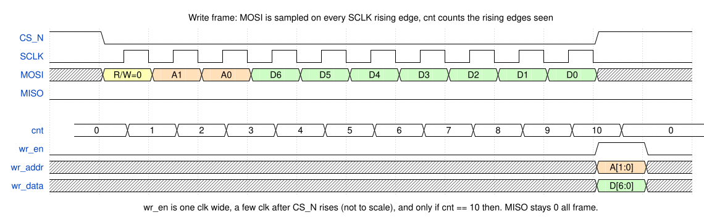
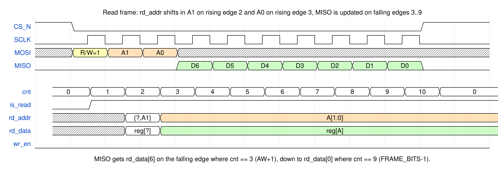
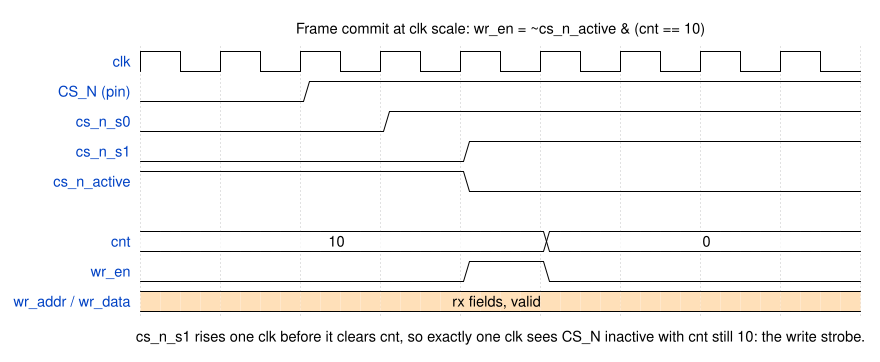
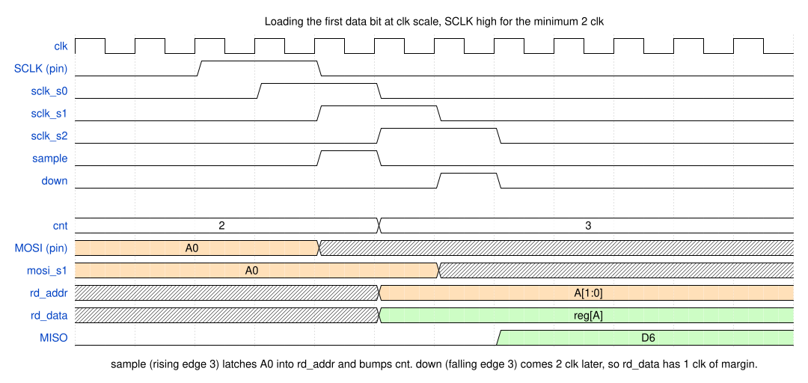

# spi_regs timing

Developer notes for `src/spi_regs.v`. The datasheet (`info.md`) shows the
frame from the master's side; this page adds the internal signals so the
`cnt` ranges in the RTL can be read off a picture instead of derived.

Waveforms are WaveDrom JSON next to this file. Rebuild with:

```bash
npx -y wavedrom-cli -i spi_write_timing.json -s spi_write_timing.svg
```

In the frame-level figures one WaveDrom cycle is one SCLK period, with the
falling edge on the cycle boundary and the rising edge in the middle. Signals
that change on the rising edge (`cnt`, `is_read`, `rd_addr`) carry
`"phase": -1`: WaveDrom's phase is in unscaled cycles, so at `hscale: 2` a
value of -1 is a half-cycle shift to the right.

## The one rule: `cnt` is the number of SCLK rising edges seen so far

Every rising edge of `SCLK` (while `CS_N` is low) shifts MOSI into `rx` and
increments `cnt`. Every decision in the module is a comparison on `cnt`:

| `cnt` at the time of... | means |
| --- | --- |
| rising edge, `cnt == 0` | the bit being sampled is `R/W` -> latch `is_read` |
| rising edge, `1 <= cnt <= AW` | the bit being sampled is an `ADDR` bit -> shift into `rd_addr` |
| falling edge, `AW+1 <= cnt <= FRAME_BITS-1` | drive the next `DATA` bit on MISO: `rd_data[DW+AW-cnt]` |
| `CS_N` seen high, `cnt == FRAME_BITS` | exactly one frame was clocked in -> `wr_en` for one clk |

At the default geometry (AW=2, DW=7, FRAME_BITS=10):

| rising edge # | bit sampled | `cnt` after it | next falling edge puts on MISO |
| --- | --- | --- | --- |
| 1 | `R/W` | 1 | 0 |
| 2 | `A1` | 2 | 0 |
| 3 | `A0` | 3 | `rd_data[6]` |
| 4 .. 9 | `D6` .. `D1` | 4 .. 9 | `rd_data[5]` .. `rd_data[0]` |
| 10 | `D0` | 10 | nothing; master has sampled every bit |

So the MISO window `cnt > AW && cnt < FRAME_BITS` is exactly DW values wide,
one per data bit, MSB first. `cnt == FRAME_BITS` must stay outside it: the
index `DW+AW-cnt` would be -1.

## Write frame



`wr_addr` / `wr_data` are plain slices of `rx`. They are only meaningful in
the single clk where `wr_en` is high; before that they are whatever is
passing through the shift register.

## Read frame



SPI is full duplex: the master clocks MISO in while it is still clocking
`ADDR` out, so `rd_addr` cannot wait for the frame to end. It is assembled
bit by bit from MOSI on rising edges 2..AW+1 and is complete after the same
edge that bumps `cnt` to AW+1. `rd_data` must be combinational from it.

## At clk scale: the write strobe



There is no explicit edge detector on `CS_N`. `cnt` is cleared by
`!cs_n_active`, which takes effect one clk after `cs_n_s1` rises. During that
one clk `cs_n_active` is already low but `cnt` still holds its final value,
and `wr_en = ~cs_n_active & (cnt == FRAME_BITS)` is true. That is the strobe.

## At clk scale: loading the first data bit



Drawn at the fastest legal SCLK, each level held for two clk. `sample` for
rising edge 3 latches `A0` into `rd_addr` and bumps `cnt` to AW+1. The
matching `down` arrives two clk later, so `rd_data` has one clk to settle.
An earlier version captured `rd_addr` from `rx` one clk later, which left no
margin at all; test A10 in `test_spi.py` guards this path.
